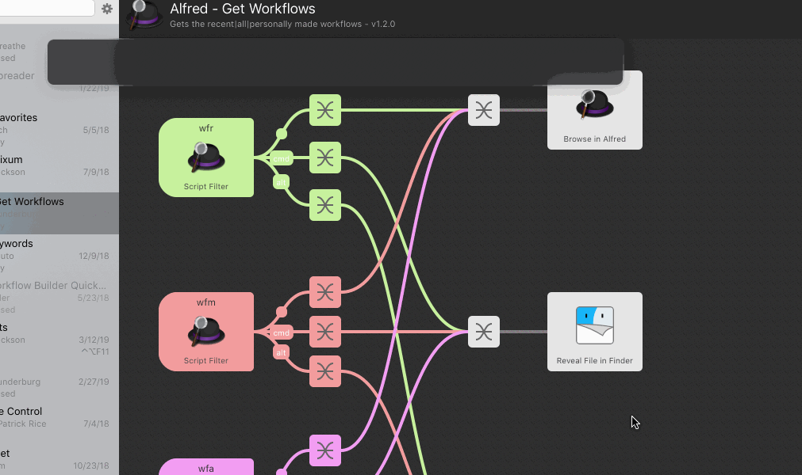

Search Installed Workflows
==============================================

Use Alfred to search for all Workflows, workflows edited recently, or workflows created by yourself. You can then browse the folder within Alfred, or reveal the folder in Finder, or select the workflow within Alfred preferences.

Note
------
- 	This 'wfm' trigger searches for my name currently, so if you want to search for your workflows you'll need to change that, I will edit that for other's uses eventually.
